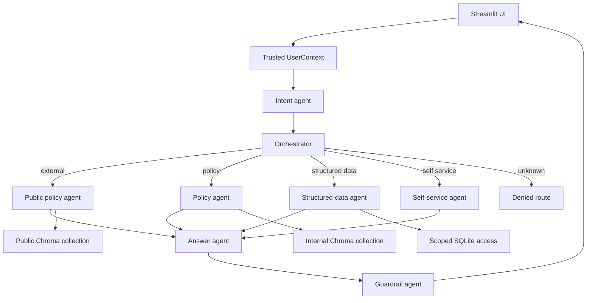

# FinPay AI

FinPay AI is an access-controlled conversational assistant for internal employees and external customers. It combines Streamlit, LangGraph, LangChain/Groq, SQLite, and ChromaDB.

The central design rule is:

> The language model only receives data that application code has already authorized, filtered, and masked.

The LLM classifies intent and writes responses. It does not assign identity, decide permissions, generate raw SQL, or choose a user's department scope.

## Features

- Internal employee, manager, and admin sessions.
- External public-user sessions isolated from internal data.
- Department-scoped SQLite queries.
- Employee directory visibility for internal users: name, work email, and work phone.
- Sensitive PII masking for addresses, salary, bank accounts, national IDs, and customer records.
- Public and internal Chroma policy collections.
- Department and role-based policy visibility filters.
- LangGraph agent pipeline with intent, routing, retrieval, answer, and guardrail stages.
- LangChain `ChatGroq` integration using the model configured in `.env`.
- Safe answer fallback when Groq is unavailable.
- Output scanning for likely emails, IBANs, and raw number sequences.
- Automated security-focused tests.

## Architecture



### Agent stages

1. **Intent agent** classifies a message as `policy`, `structured_data`, `self_service`, `public`, or `unknown`.
2. **Orchestrator** uses trusted `UserContext` and the intent to select a route.
3. **Policy agent** retrieves visibility-filtered Chroma chunks.
4. **Structured-data agent** calls the allowlisted SQLite access layer.
5. **Self-service agent** forces the authenticated user's ID for own-record lookups.
6. **Answer agent** synthesizes from authorized results only.
7. **Guardrail agent** blocks likely protected data before display.

These are LangGraph nodes with separate responsibilities. They are not independent permission systems. Authorization remains centralized in application code.

## Project layout

```text
app.py                         Streamlit entry point
requirements.txt               Python dependencies
.env                           Local configuration; never commit secrets

data/db/schema.sql            SQLite schema
data/db/finpay_poc.db         Generated demo database
data/chroma/                  Local persistent Chroma data
data/policies/                Markdown policy documents
data/scripts/seed_data.py      Generate synthetic SQLite data
data/scripts/ingest_policies.py Load policies into Chroma
data/scripts/load_doc_metadata.py Mirror policy metadata into SQLite

src/finpay/access/             User context, SQL scoping, policy visibility
src/finpay/graph/              LangGraph workflow, Groq adapter, guardrail
src/finpay/policies/           Policy parsing, ingestion, retrieval

tests/                         Unit and security regression tests
workspace/                     Architecture and current-state documentation
```

## Setup

PowerShell:

```powershell
python -m venv .venv
.\.venv\Scripts\Activate.ps1
python -m pip install -r requirements.txt
```

Configure `.env` locally:

```env
CHROMA_HOST=localhost
CHROMA_PORT=8000
GROQ_API_KEY=replace-with-your-key
GROQ_MODEL=qwen/qwen3.8-27b
```

Never commit `.env` or share the API key. If a key is exposed, revoke it and create a replacement.

## Generate demo data

The repository expects the synthetic SQLite database at `data/db/finpay_poc.db`:

```powershell
.\.venv\Scripts\python.exe data/scripts/seed_data.py
.\.venv\Scripts\python.exe data/scripts/load_doc_metadata.py
```

The seed script creates fake departments, employees, customers, transactions, offers, and support tickets. It is safe demo data, not production data.

## Chroma policies

The ingestion script prefers the configured Chroma HTTP server and otherwise uses local persistent storage:

```powershell
.\.venv\Scripts\python.exe data/scripts/ingest_policies.py
```

The application uses two collections:

- `finpay_public_policies`: public documents only.
- `finpay_internal_policies`: all policy documents.

If the HTTP server is unavailable, `app.py` falls back to `data/chroma`.

## Run the application

```powershell
.\.venv\Scripts\python.exe -m streamlit run app.py --server.headless true --server.port 8501
```

Open <http://127.0.0.1:8501>.

Stop the server with `Ctrl+C` in the terminal running Streamlit.

The sidebar provides a mock login for:

- External users
- Employees
- Managers
- Admins
- Departments and synthetic employee identities

The selected identity becomes the trusted `UserContext` used by every scoped tool.

## Access rules

### Structured data

- External users cannot query SQLite.
- Employees and managers see only their own department.
- Admins can see all departments.
- Internal users can see employee names, work email, and work phone within their permitted scope.
- Sensitive PII remains masked except for an employee viewing their own employee record.
- Resources and filter columns are allowlisted; raw SQL is never accepted from the LLM.

### Policies

- External users can retrieve only `public` policies.
- Employees and managers can retrieve `public`, `all_internal`, and their own department policies.
- Admins can retrieve department and `admin_only` policies.
- Unclassified documents are rejected.

## Testing

Run all tests:

```powershell
.\.venv\Scripts\python.exe -m unittest discover -s tests -v
```

The tests cover SQL scoping, PII masking, policy visibility, Chroma collection isolation, routing, self-service identity enforcement, guardrails, and Groq failure fallback.

## Troubleshooting

### Chroma connection error

The application first tries `CHROMA_HOST:CHROMA_PORT`. If that server is unavailable, it falls back to `data/chroma`. Confirm the local collections exist:

```powershell
.\.venv\Scripts\python.exe -c "import app; print([c.name for c in app.create_chroma_client().list_collections()])"
```

### Groq model error

A live Groq error such as `model_not_found` means the configured model is unavailable for the key or account. Verify `GROQ_MODEL` in `.env` against the models available to the account. The application logs sanitized provider errors and falls back to authorized tool results.

### Port already in use

Stop the existing Streamlit process with `Ctrl+C`, or use another port:

```powershell
.\.venv\Scripts\python.exe -m streamlit run app.py --server.headless true --server.port 8502
```

## Current limitations

- Login is a mock Streamlit selector, not production authentication.
- LangSmith tracing and the permission evaluation dataset are not yet implemented.
- Manager permissions currently match employee permissions.
- External customer authentication and own-record access are open design decisions.

See [workspace/FinPay_Chatbot_Requirements_and_Architecture.md](workspace/FinPay_Chatbot_Requirements_and_Architecture.md) for the full requirements and [workspace/Current_state.md](workspace/Current_state.md) for the implementation status.
