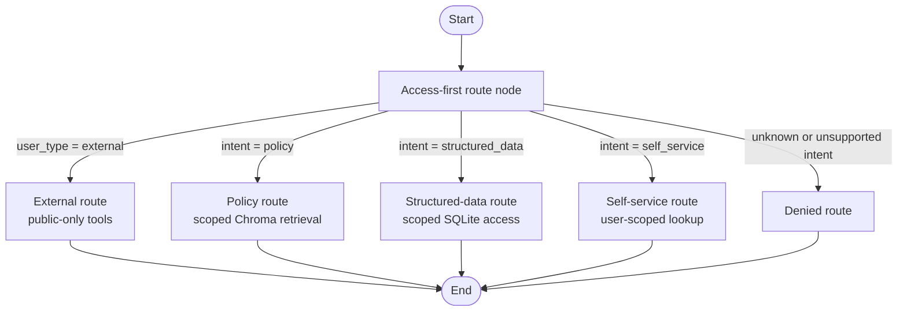

(# FinPay AI Chatbot - Current State)

Updated: 2026-09-17

## Vision

FinPay needs one conversational assistant for internal employees and
external customers. The primary engineering concern is access control:
the LLM must never receive data outside the current user's permitted scope.

## Completed

### Repository structure

- `data/` contains static policies, database schema, generated demo data, and
	data-ingestion scripts.
- `src/finpay/` contains application code.
- `tests/` contains automated tests.
- `.env` contains local Chroma connection settings and is excluded by
	`.gitignore`.

### Structured data

- SQLite schema is in `data/db/schema.sql`.
- Synthetic database generation is in `data/scripts/seed_data.py`.
- Document frontmatter loading is in `data/scripts/load_doc_metadata.py`.
- Database paths are derived from the repository, not hard-coded machine
	paths.
- Current generated data: 7 departments, 44 employees, 60 customers,
	400 transactions, 6 offers, and 50 support tickets.

### Structured-data access control

- `src/finpay/access/scoped_query.py` defines `UserContext` and
	`scoped_select`.
- External users are denied structured-data access.
- Employees and managers are restricted to their department.
- Admins can query across departments.
- Employee and customer PII is masked unless an employee is viewing their
	own employee record.
- SQL resources and filter columns are allowlisted; callers cannot provide
	arbitrary SQL.

### Policy access control

- `src/finpay/access/policy_visibility.py` builds visibility rules and Chroma
	filters.
- External users can retrieve only `public` policies.
- Employees and managers can retrieve `public`, `all_internal`, and their own
	department policies.
- Admins can retrieve all known department policies and `admin_only` policies.
- Unclassified policies are denied.

### Chroma ingestion

- Policy parsing and chunking are in `src/finpay/policies/ingestion.py`.
- `data/scripts/ingest_policies.py` supports the Chroma HTTP server through
	`.env` settings:

	```text
	CHROMA_HOST=localhost
	CHROMA_PORT=8000
	```

- Embedding model is explicitly set to `all-MiniLM-L6-v2` through Chroma's
	`DefaultEmbeddingFunction`.
- Two physical collections are used:
	- `finpay_public_policies`: public documents only.
	- `finpay_internal_policies`: all internal policy documents.
- Current Chroma state: 3 public chunks and 14 internal chunks.
- Ingestion is idempotent by chunk ID. Unchanged chunks are skipped; new,
	changed, and stale chunks are synchronized.

### LangGraph orchestration

- The access-first graph is in `src/finpay/graph/workflow.py`.
- `ConversationState` carries the trusted `UserContext`, message, intent,
	route, and response.
- External users are hard-routed to the public-only route before any internal
	tool can be called.
- Internal intents route to policy retrieval, structured-data access, or
	self-service lookup.
- Unknown internal intents are denied by default.
- The current graph nodes return placeholder responses; real SQLite and
	Chroma tool calls are the next implementation step.

#### Current graph



## Validation

The full test suite currently passes 15 tests:

```powershell
d:/Develpment/Projects/FastPayAI/.venv/Scripts/python.exe -m unittest discover -s tests -v
```

The main dependencies are recorded in `requirements.txt`: Faker, PyYAML,
ChromaDB, python-dotenv, and LangGraph.

## Not implemented yet

1. Connect scoped SQL and Chroma tools to the graph.
2. Complete the external-user walled-off subgraph with public retrieval.
3. Add the Streamlit login/session scaffold.
4. Add the output PII guardrail node.
5. Add LangSmith traces and the permission evaluation dataset.

## Open decisions

- Confirm whether managers need broader access than employees.
- Choose the POC authentication approach: mock login or lightweight JWT.
- Decide whether external users are anonymous or authenticated customers.
- Decide retention and audit requirements for admin cross-department queries.
- Decide whether Finance may see Compliance flagged-transaction reasons.
