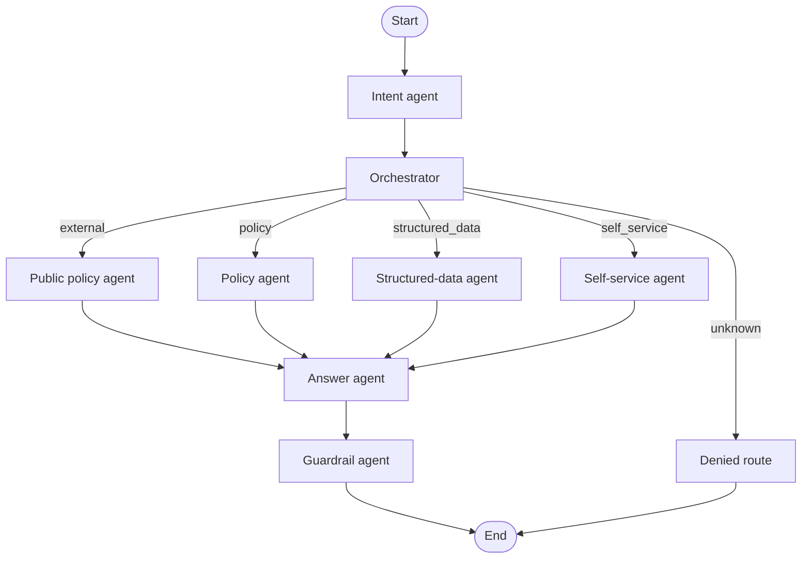

(# FinPay AI Chatbot - Current State)

Updated: 2026-09-17

## Vision

FinPay needs one conversational assistant for internal employees and
external customers. The primary engineering concern is access control:
the LLM must never receive data outside the current user's permitted scope.

## Completed

### Repository structure

- `README.md` documents setup, architecture, access rules, commands, and
	troubleshooting.
- `data/` contains static policies, database schema, generated demo data, and
	data-ingestion scripts.
- `src/finpay/` contains application code.
- `tests/` contains automated tests.
- Application, data-script, and test modules include comments at their main
	security and control-flow boundaries.
- `.env` contains local Chroma connection settings and is excluded by
	`.gitignore`.

### Structured data

- SQLite schema is in `data/db/schema.sql`.
- Synthetic database generation is in `data/scripts/seed_data.py`.
- Document frontmatter loading is in `data/scripts/load_doc_metadata.py`.
- Database paths are derived from the repository, not hard-coded machine
	paths.
- Current generated data: 7 departments, 44 employees, 60 customers,
	400 transactions, 6 offers, and 50 support tickets.

### Structured-data access control

- `src/finpay/access/scoped_query.py` defines `UserContext` and
	`scoped_select`.
- External users are denied structured-data access.
- Employees and managers are restricted to their department.
- Admins can query across departments.
- Internal users can see employee names, work email, and work phone within
	their permitted scope.
- Sensitive employee and customer PII is masked unless an employee is viewing
	their own employee record.
- SQL resources and filter columns are allowlisted; callers cannot provide
	arbitrary SQL.

### Policy access control

- `src/finpay/access/policy_visibility.py` builds visibility rules and Chroma
	filters.
- External users can retrieve only `public` policies.
- Employees and managers can retrieve `public`, `all_internal`, and their own
	department policies.
- Admins can retrieve all known department policies and `admin_only` policies.
- Unclassified policies are denied.

### Chroma ingestion

- Policy parsing and chunking are in `src/finpay/policies/ingestion.py`.
- `data/scripts/ingest_policies.py` supports the Chroma HTTP server through
	`.env` settings:

	```text
	CHROMA_HOST=localhost
	CHROMA_PORT=8000
	```

- Embedding model is explicitly set to `all-MiniLM-L6-v2` through Chroma's
	`DefaultEmbeddingFunction`.
- Two physical collections are used:
	- `finpay_public_policies`: public documents only.
	- `finpay_internal_policies`: all internal policy documents.
- Current Chroma state: 3 public chunks and 14 internal chunks.
- Ingestion is idempotent by chunk ID. Unchanged chunks are skipped; new,
	changed, and stale chunks are synchronized.

### Chroma policy retrieval

- `src/finpay/policies/retrieval.py` provides the graph-compatible policy
	retrieval tool.
- External users can query only `finpay_public_policies`.
- Internal users query `finpay_internal_policies` with a visibility filter
	built from their trusted `UserContext`.
- Every returned chunk is checked again with `can_view_policy()` before it is
	allowed into the LLM context.
- The graph accepts `chroma_client=...` and creates this policy tool
	automatically; callers can still inject a custom `policy_tool`.

### LangGraph orchestration

- The access-first graph is in `src/finpay/graph/workflow.py`.
- The graph now uses named agent stages: `intent_agent`, `orchestrator`,
	`policy_agent`, `structured_data_agent`, `self_service_agent`,
	`answer_agent`, and `guardrail_agent`.
- `ConversationState` carries the trusted `UserContext`, message, intent,
	route, and response.
- External users are hard-routed to the public-only route before any internal
	tool can be called.
- Internal intents route to policy retrieval, structured-data access, or
	self-service lookup.
- Clear employee-directory questions and common policy questions such as
	"notice period" have deterministic routing fallbacks when the LLM classifier
	is uncertain.
- Unknown internal intents are denied by default.
- Structured-data and self-service routes now call an injected tool; the
	default implementation delegates to `scoped_select` when given a SQLite
	connection.
- Policy and external routes now call an injected policy tool, allowing the
	application to enforce `policy_visibility` before querying Chroma.
- Safe tool results are carried in graph state; self-service always uses the
	trusted session `user_id` and ignores requested employee filters.

### Guardrail agent

- `src/finpay/graph/guardrail.py` checks the generated response for likely
	emails, IBANs, and long raw number sequences.
- Responses containing likely raw PII are replaced with a safe denial message
	before they reach Streamlit.
- Internal directory emails and phones are allowed by the guardrail; external
	responses remain blocked from exposing contact details.
- Guardrail tests verify that masked values remain allowed and raw values are
	blocked.

### LLM integration

- `src/finpay/graph/llm.py` uses LangChain's `ChatGroq` integration rather
	than direct HTTP requests.
- Groq configuration is loaded from `.env` through `GROQ_API_KEY` and
	`GROQ_MODEL`.
- The graph can use the adapter for intent classification before routing and
	answer synthesis after scoped results are returned.
- Intent classification is constrained to the supported intent values and
	does not make access-control decisions.
- Answer synthesis receives only results already filtered and masked by the
	application.
- If Groq answer generation fails, the answer agent returns only the already
	authorized tool results instead of failing the request or retrieving more
	data. Sanitized provider error details are logged for diagnosis.
- The current configured model is `qwen/qwen3.8-27b` from `GROQ_MODEL`.

### Streamlit interface

- `app.py` provides the mock login and chat session scaffold.
- The session builds `UserContext` from the selected user type, role,
	department, and demo employee.
- SQLite, Chroma, and LangChain Groq are initialized through cached resources.
- Chroma uses the configured HTTP server when available and falls back to the
	local `data/chroma` database when the server is unavailable.
- Structured-data resource selection is passed to the scoped application tool;
	users cannot provide raw SQL.

#### Current graph



## Validation

The full test suite currently passes 31 tests:

```powershell
d:/Develpment/Projects/FinPayAI/.venv/Scripts/python.exe -m unittest discover -s tests -v
```

The main dependencies are recorded in `requirements.txt`: Faker, PyYAML,
ChromaDB, python-dotenv, LangGraph, LangChain Groq, and Streamlit.

## Not implemented yet

1. Add LangSmith traces for user, role, department, route, and tool calls.
2. Add the permission evaluation dataset and adversarial regression cases.

## Open decisions

- Confirm whether managers need broader access than employees.
- Choose the POC authentication approach: mock login or lightweight JWT.
- Decide whether external users are anonymous or authenticated customers.
- Decide retention and audit requirements for admin cross-department queries.
- Decide whether Finance may see Compliance flagged-transaction reasons.
