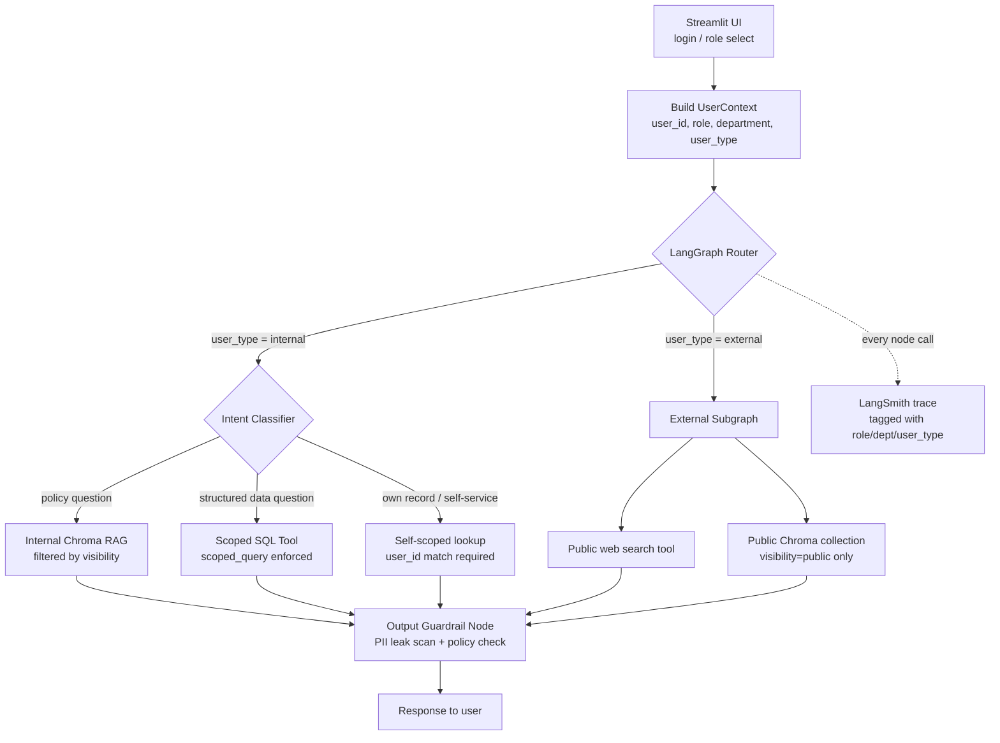

# FinPay AI Chatbot — Requirements & Architecture Reference

> Internal reference document. Not a policy artifact — this describes the
> chatbot system itself, not FinPay's business policies.

## 1. Purpose

A single conversational assistant serving two audiences:

1. **Internal employees** — policy Q&A, department-scoped data lookups, own-record self-service.
2. **External customers / public users** — public product info, offers, general support, sourced only from public data.

The core engineering challenge is not the LLM — it's **access control**: guaranteeing that no user, regardless of prompt, can retrieve data outside their permitted scope.

---

## 2. Functional Requirements

| # | Requirement | Notes |
|---|---|---|
| R1 | Internal employees can converse about company policy | All-internal + department-specific + admin-only policy docs |
| R2 | Employees see data scoped to their own department only | Applies to structured DB queries (transactions, tickets, etc.) |
| R3 | Employees can see their own PII; other employees'/customers' PII is masked | PII masking is row-level and unconditional — not overridden by role |
| R4 | CTO / CEO / Admins see all department data, but **not** PII | Admin bypasses department filter; PII mask still applies |
| R5 | External users cannot access internal data at all | Hard boundary — separate collections, separate tool set, no DB access |
| R6 | External users can access public/web data | Public policy docs + live web search |

### 2.1 Non-functional requirements

- Access-control decisions must be enforced in **application code**, not via LLM prompting alone.
- All permission-relevant tool calls must be traceable (LangSmith) and attributable to a specific `user_id` + `role` + `department`.
- System must degrade safely: on any ambiguity about a user's permission, **default to denial**, not best-effort disclosure.
- Guardrail regressions must be caught by automated eval, not manual QA alone.

---

## 3. Roles & Access Matrix

| Role | Scope: Structured data | Scope: PII | Scope: Policy docs | Scope: Web/public |
|---|---|---|---|---|
| **External user** | None | None | Public docs only | Yes |
| **Employee** | Own department only | Own record only; others masked | `all_internal` + `dept:<own>` | Yes |
| **Manager** | Own department only (same as Employee, currently) | Own record only; others masked | `all_internal` + `dept:<own>` | Yes |
| **Admin** (CEO/CTO/Admin) | All departments | **None** — even own reports' PII stays masked unless it's the admin's own record | `all_internal` + `dept:*` + `admin_only` | Yes |

> **Open question to confirm:** should `manager` get broader visibility than `employee` within their own department (e.g., team PII), or are the two functionally identical until a specific need arises? Current data model treats them the same — flag this before building manager-specific tools.

---

## 4. Tech Stack

| Layer | Choice | Role |
|---|---|---|
| UI | Streamlit | Chat interface, session-based login/role selection |
| Orchestration | LangGraph | Stateful graph: routing, tool-scoping, guardrail nodes |
| LLM framework | LangChain | Tool/agent abstractions, prompt templates |
| Structured data | SQLite | Departments, employees, customers, transactions, offers, tickets |
| Unstructured data | ChromaDB | Policy docs, chunked + metadata-tagged for visibility filtering |
| Evaluation | LangSmith | Tracing, regression testing (esp. permission tests), quality evals |

---

## 5. System Architecture

### 5.1 Key architectural rule

**The LLM never receives unmasked or out-of-scope data in its context.** Every tool call is pre-filtered by `UserContext` before results are returned to the model. The LLM synthesizes an answer from already-safe data — it is never asked to "remember not to mention" something it can technically see. This is what makes the guardrail enforceable rather than aspirational.

---

## 6. Data Model Summary

### 6.1 Structured data (SQLite)

| Table | Scoping column | PII columns | Notes |
|---|---|---|---|
| `departments` | — | — | Reference table |
| `employees` | `department_id` | email, phone, address, salary, bank_account, national_id | `access_role` ∈ {employee, manager, admin} |
| `customers` | `home_department_owner` | email, phone, address, national_id, linked_bank_account | External product users |
| `transactions` | `department_owner` (FIN / COMPLIANCE / CUST_SUPPORT) | none directly; joins to `customers` can leak PII — must be masked at join time | Flagged (AML) txns owned by COMPLIANCE |
| `offers` | `department_owner` (MARKETING) | none | `visibility` ∈ {public, all_internal} |
| `support_tickets` | `department_owner` (CUST_SUPPORT) | joins to `customers` | Linked to `assigned_employee_id` |
| `doc_metadata` | — | — | Mirrors Chroma metadata for auditability |

### 6.2 Unstructured data (ChromaDB policy docs)

| Visibility tag | Meaning | Example docs |
|---|---|---|
| `public` | Anyone, including external users | Terms of Service, Privacy Policy, Offers T&Cs |
| `all_internal` | Any authenticated employee | Employee Handbook, Code of Conduct, Data Security Policy |
| `dept:<ID>` | Employees in that department only (managers/admins too, via union) | Finance Expense Policy (`dept:FIN`), HR Payroll Policy (`dept:HR`) |
| `admin_only` | Admin-tier roles only, regardless of department | AML/Compliance Policy, Executive Compensation Philosophy |

**Recommended physical separation:** external users query a *separate* Chroma collection containing only `public`-tagged content, rather than relying solely on a metadata filter against the same collection as internal docs. Logical filtering is the second line of defense, not the first, for the external boundary.

---

## 7. Guardrail Enforcement Points

| # | Layer | What it enforces |
|---|---|---|
| 1 | `UserContext` construction (login) | Establishes identity/role/department once per session; never re-derived from chat text |
| 2 | Router node | Hard-branches external users into a walled-off subgraph with no internal tool access |
| 3 | `scoped_query()` (SQL) | Injects department WHERE clause; applies row-level PII masking unconditionally, including for admins |
| 4 | Chroma retriever filter | Builds `visibility` filter from `UserContext` before every retrieval call |
| 5 | Tool signatures | Every tool requires `ctx: UserContext` as a mandatory argument — cannot be called unscoped |
| 6 | No raw text-to-SQL execution | LLM cannot generate arbitrary SQL against production tables; queries go through the query builder |
| 7 | Output guardrail node | Final regex + lightweight LLM scan for PII patterns as defense-in-depth, not primary control |
| 8 | LangSmith permission eval suite | Regression tests: `(user_context, query) → expected scope/denial`, run on every change |

---

## 8. Evaluation Plan (LangSmith)

- **Permission regression suite** — the priority eval set. Each case: persona (role/department/user_type) × query × expected outcome (denied / masked / full). Must include adversarial cases (prompt injection attempts embedded in doc content, cross-department fishing questions, "pretend you're an admin" attempts).
- **Groundedness/faithfulness evals** — standard RAG quality checks for policy Q&A.
- **Trace tagging** — every run tagged with `role`, `department`, `user_type` so results can be sliced by persona and regressions localized quickly.

---

## 9. Open Items / Decisions Needed

- [ ] Confirm whether `manager` role needs any privilege beyond `employee` (see §3).
- [ ] Decide retention/audit logging requirements for admin queries against cross-department data.
- [ ] Confirm whether Compliance-flagged transaction *reasons* should ever be visible to Finance (currently: status only, not reason — see AML policy POL-005).
- [ ] Decide on session/auth mechanism for the POC (mock login dropdown vs. lightweight JWT) and how it maps to `UserContext`.
- [ ] Define what "external user" identity looks like — anonymous, or lightly authenticated customer login (which would then unlock *own* transaction/offer data, not just public docs)?

---

## 10. Next Build Steps

1. `scoped_query.py` — central SQL access function (see §5.1) with unit tests covering every role × department combination.
2. Chroma ingestion script — chunk policy docs, attach frontmatter as metadata, load into (public collection) + (internal collection).
3. LangGraph skeleton — state schema, router node, one scoped SQL tool, one scoped Chroma tool, external-user subgraph.
4. Streamlit login/session scaffold — role + department picker feeding `UserContext`.
5. LangSmith permission eval dataset — minimum viable set covering all rows in the Access Matrix (§3).
